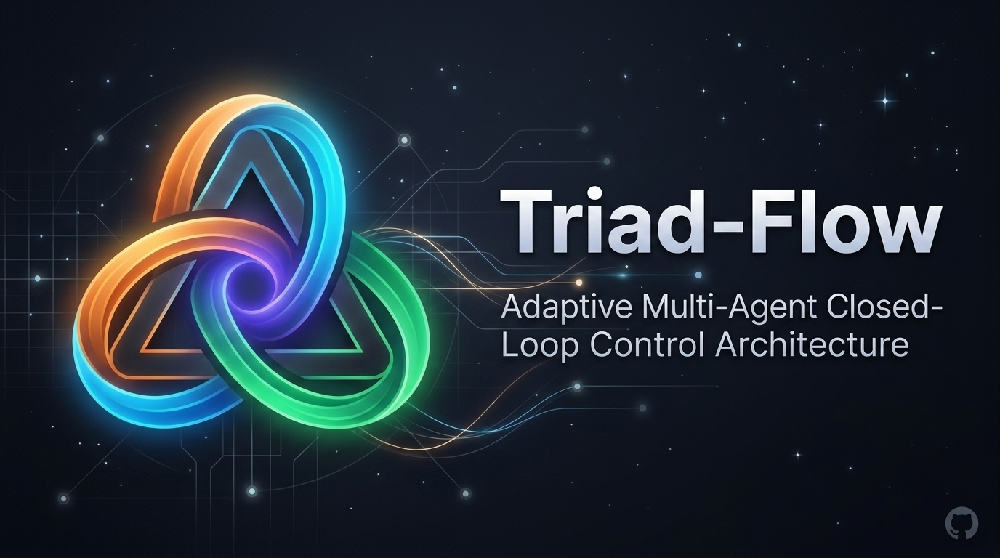

<p align="center">
  
</p>

# Triad-Flow ⚡

> **Adaptive Multi-Agent Closed-Loop Control Architecture**  
> *A deterministic safety core, scale-adaptive topology routing, and fail-closed consensus gate for multi-model code review and OODA control loops.*

---

## 🌐 What is Triad-Flow?

Triad-Flow replaces prompt-bloated, schema-heavy agent processes with an industrial-grade **Graph + Loop + Harness Engineering Triad**:

1. **🌐 Graph Engineering (拓撲路由)**:
   - Automatically evaluates Diff complexity, lockfile changes, and file risk tiers.
   - Small edits (<50 lines) route to a **Single-Agent Fast Path** (zero token waste).
   - High-risk security changes (including security-sensitive tests) or large PRs fan out into **Parallel Subagent Swarms**.
2. **🔄 Loop Engineering (控制閉環)**:
   - Heterogeneous review consensus interface: **Claude (Master Driver)** + **Gemini (Macro Radar)** + **OpenAI Codex (Micro Arbiter)** *(Target architecture / pluggable provider adapters)*.
   - Enforces **Strict Heterogeneous Quorum** (both sentries must be healthy) with Severity Escalation Deduplication.
   - **OODA Loop Controller Primitive**: Jaccard semantic stagnation & patch cycle circuit breaking *(Remediator synthesis fails closed pending adapter configuration)*.
3. **🛡️ Harness Engineering (安全夾具)**:
   - Enforces deterministic security scaffolding: multi-pattern secret redaction, symlink-aware filesystem traversal sandboxing, Quorum-enforced Fail-Closed gates, and SARIF 2.1.0 report generation.

---

## ⚡ Quickstart

```bash
# 1. Run test suite (including 18+ adversarial regression tests)
npm test

# 2. Check environment & capability health
npm run doctor

# 3. Run deterministic local simulation
npm run demo

# 4. Run scale-adaptive review on real Git diff
npm run review
```

---

## 🚀 How to Adopt in Your Projects

### A. Existing Projects (3-Minute Zero-Friction Setup)

1. **Add `CLAUDE.md` to your project root:**
   ```markdown
   # Autonomous Sentry Protocol
   1. **Pre-flight Check**: Execute `!triad-flow review` before finalizing code.
   2. **Auto-Remediation (OODA)**: On `needs-attention`, apply counter-example patches and re-test until green.
   3. **Macro Delegation**: Use Gemini 2M Context for whole-repo (>10 files) caller audits.
   ```
2. **Run baseline review:**
   ```bash
   npx triad-flow review
   ```

---

## 🤖 Tri-Agent Consensus Matrix (Target Architecture)

| Role | Provider / Engine | Superpower | Focus Area |
|---|---|---|---|
| **Master Driver** | **Anthropic Claude Code** | Code Generation & OODA Self-Healing | Implementation, Patch synthesis, CLI driver |
| **Macro Sentry** | **Google Gemini** | 2M Context Whole-Repo Radar | Cross-module interface drift, CI/CD skew, call-chain impact |
| **Micro Arbiter** | **OpenAI Codex / o3** | Deep Test-Time Compute (CoT) | Concurrency race conditions, boundary fuzzing, formal counter-examples |

---

## 📊 30-Second Engineering ROI Comparison (Design Matrix)

| Dimension | Single Model (`claude --review`) | Static Linters (Sonar / ESLint) | **Triad-Flow Closed-Loop** |
|---|---|---|---|
| **Macro Call-Chain** | Blind to distant caller regressions (>10 files) | AST-only, zero architectural comprehension | **Gemini 2M Context Radar**: Whole-repo multi-file audit and CI/CD drift analysis *(Planned)* |
| **Deep Concurrency** | Glances over complex state-machine races | Cannot simulate multi-thread runtime interleaving | **OpenAI o3/Codex CoT**: Deep test-time verification & formal counter-examples *(Planned)* |
| **Token Efficiency** | Flat high token cost on all diffs | Zero token, but high false alarms & no fixes | **Scale-Adaptive Graph**: Small diffs (<50 lines) route to single-agent fast path (0 overhead) |
| **Closed-Loop Fix** | Verbal suggestions requiring human edits | Reports errors only without auto-healing | **OODA Loop Controller**: Generates SARIF 2.1.0 & manages remediation stagnation circuit breaking |

---

## 🛡️ Cybersecurity & AI Safety Architecture

- **SARIF 2.1.0**: Standardized JSON report generation with deduplicated driver rules and URI-safe artifact locations.
- **OWASP Top 10 for LLM**:
  - `LLM02: Sensitive Info Disclosure` — Multi-pattern redaction (Google, OpenAI, Anthropic, GitHub, AWS, JWT, PEM keys).
  - `LLM06: Excessive Agency` — `OodaLoopController` 3-iteration livelock, Jaccard semantic stagnation detection, and patch cycle circuit breaker.
- **NIST SSDF (SP 800-218) & OpenSSF**: Physical symlink and sibling path traversal defense with Quorum-enforced Fail-Closed gates.
- **IEEE 352 / N-Version**: Heterogeneous multi-model consensus defense against Common-Mode Failures.

---

## 🏛️ The 8 Engineering Pillars Matrix

| Pillar | Implementation File | Key Mechanism |
|---|---|---|
| 🛡️ **1. Guardrail & Harness** | [`src/core/harness.mjs`](src/core/harness.mjs) | Multi-pattern redaction, Symlink sandbox, Quorum gate, SARIF 2.1.0 |
| 🌐 **2. Graph Engineering** | [`src/core/graph-router.mjs`](src/core/graph-router.mjs) | Scale-adaptive routing, Lockfile tracking, Security test Tier 1 routing |
| 🔄 **3. Loop Engineering** | [`src/core/loop.mjs`](src/core/loop.mjs) | Severity Escalation Merge, OODA Controller, Jaccard stagnation circuit breaker |
| 🔭 **4. Observability** | [`src/core/telemetry.mjs`](src/core/telemetry.mjs) | Ultra-lean in-process span tracer and latency profiler |
| 🎯 **5. Eval & Benchmark** | [`src/core/scoring.mjs`](src/core/scoring.mjs) | Strict mutation score verification & held-out golden CVE recall testing |
| 🧠 **6. Context Budgeting** | [`src/core/graph-router.mjs`](src/core/graph-router.mjs) | 3-Tier risk allocation (0% truncation on Auth/CI files) |
| 📦 **7. Sandbox Isolation** | [`src/core/harness.mjs`](src/core/harness.mjs) | Zero-trust physical filesystem and symlink containment |
| ⚖️ **8. Constitutional** | [`CLAUDE.md`](CLAUDE.md) | Lean, non-negotiable invariant rules (<50 lines) |

---

## 📄 License

Apache-2.0 © arcobaleno64
