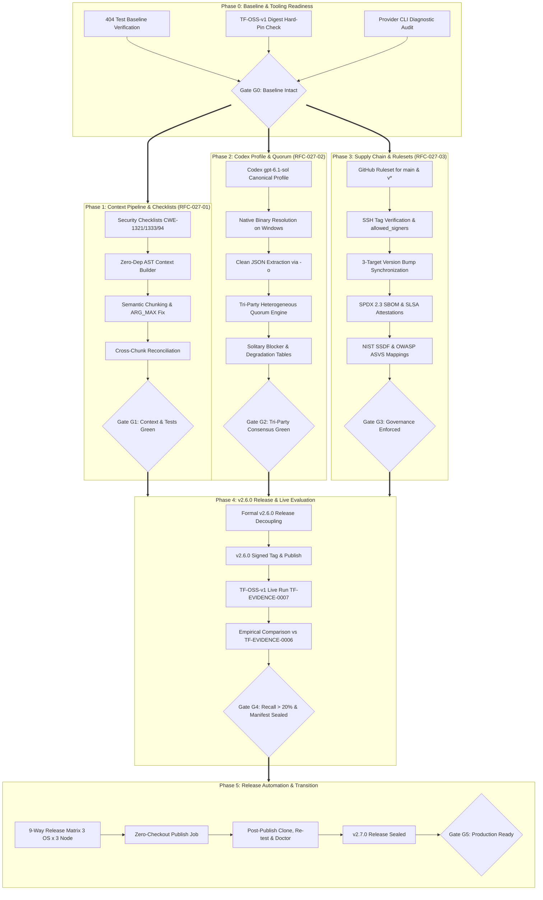

# Triad-Flow v2.7 Consolidated Milestone Roadmap
## Empirical Review Optimization, Tri-Party Heterogeneous Quorum & Supply-Chain Governance

- **Milestone Identifier**: `v2.7`
- **Document Version**: `1.0.0`
- **Status**: `APPROVED_FOR_SPECIFICATION`
- **Working Directory**: `C:\Users\arcobaleno\Documents\Code\triad-flow`
- **Integrity Mode**: `development` (Strict Planning Boundary)
- **Author**: Architectural Planning & Core Roadmap Team
- **Date**: 2026-10-01

---

## 1. Executive Summary & Vision

Triad-Flow is an autonomous, fail-closed multi-agent security review and controlled remediation system. The canonical v2.6 milestone closure demonstrated the validity of multi-provider consensus and established the first live external benchmark on real-world Node.js vulnerabilities (`TF-OSS-v1`). However, empirical observations from `TF-EVIDENCE-0006` revealed significant opportunities for architectural hardening:
1. **Empirical Review Recall**: Live frontier models achieved only a 20.0% recall rate (1/5 golden CWEs caught) primarily due to context starvation (models only received isolated diff lines without enclosing AST scope), absence of explicit vulnerability checklists, rigid file coverage contracts causing false-incomplete terminations, and latency timeouts on larger diffs.
2. **Quorum Diversity & Independence**: The existing engine enforces a two-party `STRICT_HETEROGENEOUS` quorum between Google (`agy` / `gemini-3.8-flash`) and Anthropic (`claude` / `claude-5.5-sonnet`). Integrating OpenAI Codex (`gpt-6.1-sol`) establishes a tri-party heterogeneous review quorum, but requires rigorous, evidence-aware consensus semantics to ensure that majority voting never erases solitary, high-severity security findings.
3. **Supply-Chain Governance & Release Automation**: Triad-Flow requires institutional-grade release engineering, transitioning from ad-hoc manual tags to automated, cryptographically attested releases (SPDX 2.3 SBOMs, SLSA build provenance, hardware-backed SSH signatures, 9-way OS/Node verification matrices, and GitHub Branch Rulesets) mapped to NIST SP 800-218 (SSDF v1.1) and OWASP ASVS v5.0.0.

The **v2.7 Milestone** resolves these three pillars through a phased, contract-driven architecture specified across three core RFCs:
- **RFC-027-01**: Review Prompt & Context Optimization (AST context injection, domain checklists, chunking, resumability).
- **RFC-027-02**: Tri-Party Quorum Consensus (Codex `gpt-6.1-sol` integration, corroboration vs. solitary blocking authority, fail-closed degradation).
- **RFC-027-03**: Supply-Chain Governance & Branch Protection (GitHub rulesets, signed tags, SBOM attestations, normative standards mapping).

---

## 2. Authoritative Baseline & Starting Invariants

All milestone planning, architectural specifications, and implementation phases operate under the following immutable baseline constraints:

| Baseline Attribute | Canonical State / Value | Verification / Integrity Mechanism |
|---|---|---|
| **Canonical Commit** | `fe57597c8fce5d699f764ec4d4dfe3d1e5b5cc73` | Git tree SHA verification (`git log -n 1`) |
| **Milestone State** | `V2.6_MILESTONE_CLOSED` | Milestone tracking registry |
| **Package Version** | `2.5.1` (in `package.json:3`) | v2.6 represents a milestone closure, not an official release tag |
| **Test Baseline** | `404 total / 401 pass / 3 expected skips / 0 fail` | Verified via `node --test` (offline routine test run, 31.9s) |
| **Expected Skips** | 3 skips in `tests/real-provider-pilot.test.mjs` | Skipped during offline tests; execute only in live provider pilot |
| **Frozen Benchmark Corpus** | `TF-OSS-v1` (5 human-adjudicated real-world cases) | Pinned in `tests/fixtures/real-oss-fixtures.mjs` and `docs/real-oss-corpus-v1.md` |
| **Corpus Digest** | `sha256:47ed3ce44878b77572005358a16511e3f0900dda11d14443e6a2a84baf501625` | Deterministic SHA-256 pin evaluated via `createCorpusIdentity()` |
| **Historical Empirical Run** | `TF-EVIDENCE-0006` | Pinned in `evidence-runs/TF-EVIDENCE-0006/` |
| **Empirical Metrics (v2.6)** | Recall: 20.0%, Precision: 50.0%, Latency: 69.780s | Historical baseline measurements across 5 real CVEs |
| **Runtime Dependencies** | Exactly zero runtime npm dependencies | `package.json` contains no `dependencies` section |
| **Platform Target** | Node.js `>=18.0.0` across Linux, macOS, and Windows | Multi-OS compatibility verified in CI matrix |

---

## 3. Non-Goals & Architectural Boundaries

To ensure strict engineering discipline and prevent scope expansion, the following boundaries are non-negotiable for v2.7:

1. **Question Paper Immutability Invariant**:
   - The `TF-OSS-v1` corpus files, base repositories, historical vulnerability patches, golden CWE labels, and test definitions are permanently frozen.
   - Under NO circumstances may the benchmark corpus or scoring tolerances be modified to artificially improve recall or precision numbers. All improvements must be proven against the immutable question paper.
2. **Historical Evidence Immutability**:
   - `TF-EVIDENCE-0006` and prior evidence bundles (`TF-EVIDENCE-0001` through `0004`) are immutable historical records. They must not be altered, deleted, or re-recorded.
3. **Zero Runtime Dependency Invariant**:
   - `package.json` MUST NOT gain any runtime npm dependencies (`"dependencies": {}`). All AST parsing, context extraction, subprocess transports, cryptographic hashing, and release scripts must use native Node.js built-ins (`node:fs`, `node:path`, `node:child_process`, `node:crypto`, `node:os`).
4. **Planning-Only Boundary**:
   - During the architecture and specification phase, no production code, configuration files, git tags, or GitHub repository settings may be mutated.
5. **No Majority-Rules Approval**:
   - A naive `2-of-3 = APPROVE` voting scheme is strictly rejected. Two providers reporting a clean diff must never override or silence an authentic Critical or High finding reported by a solitary provider.
6. **No Hidden Model Reasoning**:
   - Triad-Flow does not rely on opaque chain-of-thought tokens or hidden LLM scratchpads as an architectural contract. All reasoning must be externalized into deterministic, auditable schemas: findings, evidence references, AST locators, coverage receipts, and disagreement ledgers.
7. **No Synthetic Quorum Fabrication**:
   - An unavailable, timed-out, or crashing provider must never be treated as "clean" or "approving". Missing providers force explicit fail-closed degradation.

---

## 4. Phase Decomposition (Phases 0 through 5)

The v2.7 architecture is structured into six sequential phases to guarantee isolated verification, risk reduction, and continuous test greenness.

```
┌────────────────────────────────────────────────────────────────────────┐
│                        PHASE ROADMAP OVERVIEW                          │
├────────────────────────────────────────────────────────────────────────┤
│ Phase 0: Baseline & Tooling Readiness                                  │
│   ├── Test Suite & Hermetic Baseline Verification (404 tests)          │
│   ├── Provider CLI Doctor Probing & Windows Binary Resolution          │
│   └── Offline Cryptographic Manifest Assertions                        │
├────────────────────────────────────────────────────────────────────────┤
│ Phase 1: Context Pipeline & Checklists (RFC-027-01)                    │
│   ├── Structured Evidence-Oriented Prompts & CWE Checklists            │
│   ├── Zero-Dependency AST Context Injection (Enclosing Functions/Scope)│
│   ├── Semantic Chunking & Windows ARG_MAX Protection                   │
│   └── Cross-Chunk Finding Reconciliation & Resumability Checkpoints   │
├────────────────────────────────────────────────────────────────────────┤
│ Phase 2: OpenAI Codex Profile & Tri-Party Quorum (RFC-027-02)          │
│   ├── Canonical Codex Provider Profile (`gpt-6.1-sol`)                 │
│   ├── Clean JSON Output Isolation via `-o` (Banner Contamination Fix)  │
│   ├── Tri-Party Heterogeneous Quorum Engine (Google + Anthropic + OAI) │
│   └── Corroboration vs. Solitary Blocking Authority & Degradation      │
├────────────────────────────────────────────────────────────────────────┤
│ Phase 3: Supply-Chain Governance & Branch Rulesets (RFC-027-03)        │
│   ├── GitHub Ruleset Definitions for `main` & `refs/tags/v*`           │
│   ├── 4-Tier Governance Model & Diagonal Status Check Enforcement      │
│   ├── SPDX 2.3 SBOM Generation & SLSA Build Provenance Attestations    │
│   └── Normative Mapping: NIST SP 800-218 (SSDF v1.1) & OWASP ASVS 5.0  │
├────────────────────────────────────────────────────────────────────────┤
│ Phase 4: Formal v2.6.0 Closure & v2.7.0 Empirical Evaluation           │
│   ├── Decoupled Formal Release of `v2.6.0` (Milestone Closure)         │
│   ├── Live Benchmark Execution on Frozen TF-OSS-v1                     │
│   ├── Generation of Immutable Evidence Bundle `TF-EVIDENCE-0007`       │
│   └── Direct Empirical Comparison vs. TF-EVIDENCE-0006 Baseline        │
├────────────────────────────────────────────────────────────────────────┤
│ Phase 5: Release Automation & Final Transition                         │
│   ├── Full 9-Way Matrix Verification (3 OS × 3 Node)                   │
│   ├── Zero-Checkout Publish Job & Cryptographic Attestation Minting    │
│   ├── Post-Publish Re-test & Doctor Diagnostics Verification           │
│   └── Final Transition to v2.7.0 Stable Release                        │
└────────────────────────────────────────────────────────────────────────┘
```

---

### Phase 0: Baseline & Tooling Readiness

#### 0.1 Scope & Objectives
Establish a verified, tamper-proof operational environment before any architectural modifications begin. Validate that the current repository state strictly satisfies all canonical invariants, verify CLI toolchain availability across operating systems, and ensure diagnostic probes accurately report system capabilities.

#### 0.2 Detailed Tasks & Work Items
1. **Test Baseline Audit**:
   - Execute `npm test` across all 37 test suites.
   - Assert exactly `404 total / 401 pass / 3 expected skips / 0 fail`.
   - Validate that the 3 skips correspond strictly to live provider tests in `tests/real-provider-pilot.test.mjs`.
2. **Corpus & Evidence Cryptographic Pinning**:
   - Re-evaluate SHA-256 digest of `TF-OSS-v1` cases. Confirm match against `sha256:47ed3ce44878b77572005358a16511e3f0900dda11d14443e6a2a84baf501625`.
   - Run `node scripts/verify-artifact-manifest.mjs evidence-runs/TF-EVIDENCE-0006` to assert historical bundle integrity.
3. **Provider Tooling Diagnostic**:
   - Run `triad-flow doctor` to evaluate local provider binaries: Google (`agy`), Anthropic (`claude`), and OpenAI (`codex`).
   - Validate detection of Windows batch wrappers vs. native executables (identifying `@openai/codex-win32-x64/vendor/.../bin/codex.exe`).

#### 0.3 Deliverables
- Verified Phase 0 Audit Log recording test suite execution, corpus digest, and CLI tool versions.
- Zero code modifications.

#### 0.4 Acceptance & Gate Criteria (Gate G0)
- `npm test` exits 0 with 401 pass / 3 skip / 0 fail.
- Frozen corpus digest matches byte-for-byte.
- `package.json` dependencies remain empty.

---

### Phase 1: Context Pipeline & Checklists (RFC-027-01)

#### 1.1 Scope & Objectives
Overcome the context starvation and prompt weaknesses that limited `TF-EVIDENCE-0006` to 20% recall. Implement structured vulnerability checklists, zero-dependency AST context extraction, deterministic context budgeting, semantic diff chunking with Windows ARG_MAX protection, and resilient staged review execution.

#### 1.2 Detailed Tasks & Work Items
1. **Taxonomy & Security Review Checklists**:
   - Implement structured checklists targeting top vulnerability classes in `src/adapters/review-prompts.mjs`:
     - Prototype Pollution (`CWE-1321`): `__proto__`, `constructor.prototype`, recursive merge loops, argument hierarchy.
     - Regular Expression Denial of Service (`CWE-1333`): Nested quantifiers, overlapping character classes, unbounded whitespace.
     - Code & Template Injection (`CWE-94` / `CWE-74`): Dynamic evaluation, `Function()`, template engine configuration options.
     - Command Injection (`CWE-78`): Shell concatenation, unquoted parameters.
     - Path Traversal (`CWE-22`): Relative navigation (`..`), symlink resolution.
2. **Zero-Dependency AST Context Injection (`src/core/context-builder.mjs`)**:
   - Extend the existing `BuiltinSemanticAdapter` (`src/core/semantic-parser-adapter.mjs`) to extract structural context from modified files:
     - Enclosing function header, parameter list, and enclosing class/object.
     - Imported symbols and export definitions.
     - Local variable declarations and return expressions.
   - Maintain zero external runtime dependencies by using standard lexical and block tokenizers with fallback to raw diff when unparseable.
3. **Deterministic Multi-Layer Context Budgeting**:
   - Implement byte-budget allocator across four priority layers:
     - Layer 0 (Mandatory): Unified diff hunks.
     - Layer 1 (High): Local AST enclosing scope (±15 lines surrounding diff).
     - Layer 2 (Medium): Module imports and exports.
     - Layer 3 (Low): Callers and callee symbol definitions.
   - Enforce hard ceiling matching provider input limits (`maxInputBytes: 1MB`), allocating tokens deterministically.
4. **Semantic Chunking & Windows ARG_MAX Protection (`src/core/chunk-manager.mjs`)**:
   - Break large multi-file diffs into coherent file/hunk clusters when diff exceeds safe thresholds (8 KB on Windows, 64 KB on POSIX).
   - Generate atomic chunk review tasks with individual coverage receipts.
5. **Cross-Chunk Finding Reconciliation & Resumability**:
   - Implement deduplication across chunks using `canonicalFindingKey`: matching canonical path, overlapping line span (±5 lines), and normalized CWE/rule token.
   - Introduce staged progress persistence: save intermediate chunk receipts to ephemeral disk cache. If Chunk $N$ times out, findings from Chunks $1 \dots N-1$ are preserved.
6. **Refactored Coverage Contract**:
   - Replace brittle string array matching with robust coverage receipts: distinguish between files analyzed, files omitted due to size, and files outside review scope.

#### 1.3 Deliverables
- `docs/rfc/RFC-027-01-review-prompt-and-context-optimization.md`.
- Implementation modules: `src/adapters/review-prompts.mjs`, `src/core/context-builder.mjs`, `src/core/chunk-manager.mjs`, `src/adapters/staged-review.mjs`.
- Unit and contract test suite additions under `tests/context-builder.test.mjs` and `tests/chunk-manager.test.mjs`.

#### 1.4 Acceptance & Gate Criteria (Gate G1)
- All existing 404 tests continue to pass.
- New unit tests for AST extraction, chunking, and prompt generation achieve 100% pass rate.
- Windows ARG_MAX protection verifies that diffs > 8 KB are automatically chunked or streamed via stdin without process crashes.
- Zero runtime npm dependencies added.

---

### Phase 2: OpenAI Codex Profile & Tri-Party Quorum (RFC-027-02)

#### 2.1 Scope & Objectives
Integrate OpenAI Codex (`gpt-6.1-sol`) as a canonical, first-class review provider alongside Google `agy` and Anthropic `claude`. Implement a deterministic tri-party heterogeneous quorum consensus engine that guarantees corroboration tracking, independent solitary blocking authority, and fail-closed degradation truth tables.

#### 2.2 Detailed Tasks & Work Items
1. **Canonical Codex Provider Profile (`src/adapters/provider-profiles.mjs`)**:
   - Define canonical `codex` profile:
     - Executable: `codex` (with automatic native resolution to `codex.exe` on Windows).
     - Subcommand: `exec` (non-interactive execution).
     - Model: `gpt-6.1-sol`.
     - Mandatory safety arguments: `--sandbox=read-only`, `--ephemeral`, `--color never`.
     - Prohibited arguments: `--dangerously-bypass-approvals-and-sandbox`, `-s workspace-write`, `apply`, `--approve-for-me`.
     - Input channel: `stdin` (via `-` prompt argument).
     - Environment variable allowlist: `PATH`, `SYSTEMROOT`, `TEMP`, `TMP`, `USERPROFILE`, `HOME`, `OPENAI_API_KEY`, `CODEX_HOME`.
2. **Platform Native Binary Resolution (Node.js CVE-2024-27980 Fix)**:
   - On Windows, detect if `codex` is an npm batch wrapper (`codex.cmd`).
   - Resolve directly to the underlying bundled binary:
     `node_modules/@openai/codex/node_modules/@openai/codex-win32-x64/vendor/.../bin/codex.exe`.
   - Execute with `shell: false`, eliminating Windows `EINVAL` crashes and `DEP0190` security warnings.
3. **Clean Output Extraction via `-o` Parameter**:
   - Solve the stdout contamination problem (where Codex prints banners, session IDs, hook logs, and token usage into stdout, corrupting JSON extraction).
   - Pass `-o <tempFile>` (or `--output-last-message <tempFile>`) to capture pure, isolated JSON assistant messages.
4. **Tri-Party Heterogeneous Quorum Engine (`src/core/loop.mjs`)**:
   - Implement `QuorumPolicies.TRI_PARTY_HETEROGENEOUS`.
   - Validate presence of three distinct vendor families: `google`, `anthropic`, and `openai`.
   - Mint consensus capabilities using internal execution nonces stored in the module-private `WeakSet`.
5. **Decoupled Approval vs. Blocking Authority**:
   - **Corroboration Quorum**: Track multi-vendor agreement ($2/3$ or $3/3$) to establish high-confidence findings.
   - **Solitary Blocking Authority**: Any single provider reporting an authentic Critical or High finding holds veto power. Gate evaluates to `BLOCK`.
   - **Approval Authority**: Gate evaluates to `APPROVE` if and only if all available providers report zero blocking findings, coverage is 100%, and quorum is satisfied.
6. **Graceful Degradation State Machine & Truth Tables**:
   - Formalize transition logic:
     - $3/3$ Active: Full tri-party consensus.
     - $2/3$ Active (1 provider failed/timed out): Degrades to dual-party heterogeneous consensus. Missing provider is recorded as `UNAVAILABLE` (never synthesized as clean).
     - $1/3$ Active: Allowed ONLY for Tier 2/3 low-risk diffs (<50 lines). Fails closed (`BLOCK`) for Tier 1 high-risk diffs.
     - $0/3$ Active: Immediate fail-closed abort (`status: incomplete`, `gate: block`).
7. **Tri-Party Disagreement Ledger Extensions**:
   - Extend `disagreement-ledger.json` to record vendor divergence, lone dissenters, locator discrepancies, and severity upgrades.

#### 2.3 Deliverables
- `docs/rfc/RFC-027-02-tri-party-quorum-consensus.md`.
- Implementation updates in `src/adapters/provider-profiles.mjs`, `src/adapters/cli-transport.mjs`, `src/core/loop.mjs`, and `src/core/independent-verifier.mjs`.
- Test suite: `tests/codex-profile.test.mjs`, `tests/tri-party-quorum.test.mjs`.

#### 2.4 Acceptance & Gate Criteria (Gate G2)
- All existing 404 tests pass.
- New Codex adapter and tri-party quorum tests pass without skipping.
- Probing `codex` on Windows runs with `shell: false` without `EINVAL` errors.
- Consensus engine guarantees that a solitary Critical finding from any single provider blocks the gate, even if the other two providers vote clean.
- Zero runtime npm dependencies added.

---

### Phase 3: Supply-Chain Governance & Branch Rulesets (RFC-027-03)

#### 3.1 Scope & Objectives
Design and implement formal repository governance, release integrity controls, and security framework compliance. Formulate GitHub Ruleset definitions for `main` and release tags, automate SPDX 2.3 SBOM generation, implement SLSA build provenance attestations, and map all controls to NIST SP 800-218 (SSDF v1.1) and OWASP ASVS v5.0.0.

#### 3.2 Detailed Tasks & Work Items
1. **GitHub Ruleset Configuration for `main`**:
   - Author authoritative ruleset schema for `main`:
     - Mandatory pull requests with at least 1 approving review from Code Owners.
     - Dismissal of stale reviews upon new push.
     - Resolution of all review comment threads required before merge.
     - Strict status checks with branch up-to-date requirement:
       - `ci (ubuntu-latest, 18)`
       - `ci (windows-latest, 20)`
       - `ci (macos-latest, 22)`
     - Mandatory linear history (prohibiting merge commits via squash/rebase).
     - Cryptographically signed commits required.
     - Branch deletion and force-pushes prohibited (`enforce_admins: true`, zero bypass actors).
2. **Release Tag Protection Ruleset (`refs/tags/v*`)**:
   - Protect release tags against unauthorized creation, deletion, or moving.
   - Restrict tag creation authority to designated maintainer roles with SSH signing keys.
3. **Cryptographic Tag Verification via `.github/allowed_signers`**:
   - Enforce SSH tag signature verification in CI:
     `git verify-tag --raw "$GITHUB_REF_NAME"` validated against `.github/allowed_signers`.
   - Prevent unsigned or untrusted tags from triggering release pipelines.
4. **Three-Target Version Bump Synchronization**:
   - Verify lockstep version alignment via `scripts/bump-version.mjs`:
     1. `package.json` (`version`)
     2. `src/core/harness.mjs` (SARIF driver version)
     3. `src/core/review-run-report.mjs` (`TOOL_VERSION`)
   - CI step `npm run check-version` fails closed on any mismatch.
5. **Supply-Chain Integrity & Attestation Automation**:
   - Automated SPDX 2.3 SBOM generation via `npm sbom --sbom-format=spdx` -> `triad-flow.spdx.json`.
   - Byte-level SHA-256 checksum generation -> `triad-flow.spdx.json.sha256`.
   - SLSA Build Provenance attestation via `actions/attest-build-provenance` on package tarballs.
   - In-toto predicate attestation linking SBOM to tarball via `actions/attest`.
   - Independent file attestation on the SBOM document itself.
6. **Normative Framework Mapping**:
   - Produce exhaustive traceability matrices mapping Triad-Flow controls to:
     - NIST SP 800-218 (SSDF v1.1): PO.1.1–5.2, PS.1.1–3.1, PW.1.1–9.1, RV.1.1–3.1.
     - OWASP ASVS v5.0.0: V1.14 (Build/Deployment), V4.1/4.3 (Access Control), V5.1/5.5 (Validation/Object Security), V8.2 (Cryptographic Integrity), V10.1 (Code Integrity), V11.1 (Business Logic), V12.1 (Filesystem Confinement), V14.2 (Dependency Management), V15 (AI/Model Assurance).

#### 3.3 Deliverables
- `docs/rfc/RFC-027-03-supply-chain-governance-and-branch-protection.md`.
- GitHub Ruleset configuration files under `.github/rulesets/`.
- Supply chain test assertions under `tests/supply-chain.test.mjs`.

#### 3.4 Acceptance & Gate Criteria (Gate G3)
- All existing 404 tests pass.
- Version check script successfully verifies 3-target lockstep.
- Supply chain tests pass: verifying SSH signature validation, SBOM generation, and zero runtime dependencies.
- Complete NIST SSDF v1.1 and OWASP ASVS v5.0.0 mapping matrices documented.

---

### Phase 4: Formal v2.6.0 Milestone Closure & v2.7.0 Empirical Evaluation

#### 4.1 Scope & Objectives
Execute two distinct, decoupled milestones:
1. **Formal v2.6.0 Software Release**: Decouple and publish the formal `v2.6.0` release from milestone commit `fe57597c8fce5d699f764ec4d4dfe3d1e5b5cc73`, preserving historical `TF-EVIDENCE-0006` and corpus integrity.
2. **v2.7.0 Empirical Benchmark Run (`TF-EVIDENCE-0007`)**: Execute the optimized tri-party review engine against the frozen `TF-OSS-v1` corpus, measuring recall, precision, and latency improvements without modifying benchmark inputs.

#### 4.2 Detailed Tasks & Work Items
1. **Formal v2.6.0 Release Execution**:
   - Author release commit strictly limited to:
     - Version bump from `2.5.1` to `2.6.0` via `node scripts/bump-version.mjs 2.6.0`.
     - Changelog and release notes documentation.
     - Zero modifications to `src/`, `tests/fixtures/`, or `evidence-runs/`.
   - Create annotated SSH-signed tag `v2.6.0`.
   - Run release workflow `.github/workflows/release.yml` with 9-way matrix verification.
   - Seal `v2.6.0` GitHub Release with build provenance and SBOM attestations.
2. **v2.7.0 Live Empirical Benchmark Execution (`TF-EVIDENCE-0007`)**:
   - Execute the complete tri-party review suite across all 5 cases in frozen `TF-OSS-v1`:
     - `TF-OSS-001` (minimist prototype pollution, CWE-1321)
     - `TF-OSS-002` (ini section pollution, CWE-1321)
     - `TF-OSS-003` (JSON-Patch constructor pollution, CWE-1321)
     - `TF-OSS-004` (semver whitespace ReDoS, CWE-1333)
     - `TF-OSS-005` (ejs outputFunctionName RCE, CWE-94)
   - Participating providers: Google `gemini-3.8-flash`, Anthropic `claude-5.5-sonnet`, OpenAI `gpt-6.1-sol`.
   - Record all raw outputs, receipts, execution timings, and consensus gates.
3. **Evidence Bundle Generation & Verification (`evidence-runs/TF-EVIDENCE-0007/`)**:
   - Construct authoritative evidence bundle matching the structure of `TF-EVIDENCE-0006`:
     - `corpus-identity.json` (asserting unchanged digest `sha256:47ed3ce4...`)
     - `release-identity.json`
     - `audit-receipt.json`
     - `benchmark-results.json`
     - `disagreement-ledger.json`
     - `evidence-index.json`
     - `artifact-manifest.json` (SHA-256 manifest of all files)
     - `README-EVIDENCE.md` (offline verification instructions)
     - `verification/` (independent verification records for all 5 cases)
4. **Empirical Evaluation & Comparative Analysis**:
   - Compute comparative metrics against `TF-EVIDENCE-0006`:
     - Recall Target: $\ge 60.0\%$ (vs. $20.0\%$ baseline).
     - Precision Target: $\ge 50.0\%$ (vs. $50.0\%$ baseline).
     - Average Latency Target: $\le 60.0\text{s}$ (vs. $69.780\text{s}$ baseline).
     - Incomplete Execution Rate: $0/5$ (vs. $3/5$ baseline).

#### 4.3 Deliverables
- Sealed official GitHub Release for `v2.6.0`.
- Complete, immutable evidence bundle: `evidence-runs/TF-EVIDENCE-0007/`.
- Empirical comparison report in `docs/benchmarks/tf-oss-v1-v2.7-evaluation.md`.

#### 4.4 Acceptance & Gate Criteria (Gate G4)
- `v2.6.0` release published successfully with valid SSH signatures and SLSA attestations.
- Frozen corpus digest for `TF-OSS-v1` remains exactly `sha256:47ed3ce44878b77572005358a16511e3f0900dda11d14443e6a2a84baf501625`.
- `TF-EVIDENCE-0007` passes offline manifest verification: `node scripts/verify-artifact-manifest.mjs evidence-runs/TF-EVIDENCE-0007`.
- Recall strictly improves over baseline ($> 20.0\%$).
- Zero incomplete runs ($0/5$ cases incomplete).

---

### Phase 5: Release Automation & Final Transition

#### 5.1 Scope & Objectives
Finalize and execute the production release pipeline for `v2.7.0`. Enforce the exhaustive 9-way matrix verification, execute zero-checkout publishing, conduct automated post-publish verification, and transition the repository into stable v2.7 governance.

#### 5.2 Detailed Tasks & Work Items
1. **Pre-Release Matrix Verification (9-Way Exhaustive Matrix)**:
   - Execute `.github/workflows/release.yml`:
     - 3 Operating Systems: `ubuntu-latest`, `windows-latest`, `macos-latest`.
     - 3 Node.js Versions: `18`, `20`, `22`.
     - Full test suite execution ($>420$ tests, $0$ failures).
     - Version lockstep validation across all targets.
     - Package dry-run packaging check (`npm pack --dry-run`).
2. **Zero-Checkout Publish Job**:
   - Restrict write permissions (`contents: write`, `id-token: write`, `attestations: write`) strictly to the publish job.
   - Do NOT perform git checkout in the publish job, preventing unauthorized script execution during publication.
   - Generate package tarball `arcobaleno64-triad-flow-2.7.0.tgz`.
   - Generate SPDX 2.3 SBOM and SHA-256 digest.
   - Mint SLSA build provenance and SBOM in-toto attestations.
3. **Automated Post-Publish Verification (`verify-published`)**:
   - Download published tarball and verify attestations via `gh attestation verify`.
   - Verify SBOM SHA-256 digest matches published file.
   - Perform clean clone of published tag in isolated runner:
     - Install package in pristine environment.
     - Execute `npm test`.
     - Execute `triad-flow doctor` to verify CLI health.
4. **Rollback & Revocation Readiness**:
   - Verify operational readiness of the rollback protocol in case of post-publish anomalies.

#### 5.3 Deliverables
- Official GitHub Release `v2.7.0` with signed tarball, SBOM, and attestations.
- Updated repository documentation reflecting v2.7 capabilities.

#### 5.4 Acceptance & Gate Criteria (Gate G5)
- All 9 matrix jobs pass cleanly in CI.
- All 3 GitHub attestations (build provenance, SBOM predicate, SBOM file identity) verified via `gh attestation verify`.
- Post-publish fresh clone and `triad-flow doctor` pass without error.
- Branch protection rulesets actively enforced on `main`.

---

## 5. Dependency Graph & Phase Sequencing

### 5.1 Mermaid Transition Diagram



### 5.2 Universal ASCII Dependency Flow

```text
+-------------------------------------------------------------------------+
|                  Phase 0: Baseline & Tooling Readiness                  |
|  - 404 Tests Pass  |  - TF-OSS-v1 Pinned  |  - Provider CLIs Probed     |
+------------------------------------+------------------------------------+
                                     |
                                     v [Gate G0]
       +-----------------------------+-----------------------------+
       |                             |                             |
       v                             v                             v
+-----------------------+ +-----------------------+ +-----------------------+
|  Phase 1: Context     | |  Phase 2: Codex &     | |  Phase 3: Supply      |
|  Pipeline & Checklists| |  Tri-Party Quorum     | |  Chain & Rulesets     |
|  (RFC-027-01)         | |  (RFC-027-02)         | |  (RFC-027-03)         |
|                       | |                       | |                       |
| - CWE Checklists      | | - Codex gpt-6.1-sol   | | - GitHub Rulesets     |
| - Zero-Dep AST Scope  | | - Native EXE (Win32)  | | - SSH Tag Signatures  |
| - Chunking & ARG_MAX  | | - Clean JSON via -o   | | - 3-Way Version Bump  |
| - Reconciliation      | | - Solitary Blocker    | | - SPDX 2.3 SBOM       |
| - Checkpoint Resumption| | - Fallback Tables    | | - SSDF & ASVS Mappings|
+-----------+-----------+ +-----------+-----------+ +-----------+-----------+
            |                         |                         |
            v [Gate G1]               v [Gate G2]               v [Gate G3]
            +-------------------------+-------------------------+
                                      |
                                      v
+-------------------------------------------------------------------------+
|       Phase 4: Formal v2.6.0 Release & v2.7.0 Empirical Evaluation      |
|                                                                         |
|  [Track A: Formal v2.6.0 Closure]   | [Track B: Live Evaluation]        |
|  - Version bump 2.5.1 -> 2.6.0      | - Live tri-party run on TF-OSS-v1 |
|  - SSH-signed tag v2.6.0            | - Generate TF-EVIDENCE-0007       |
|  - Sealed GitHub Release v2.6.0     | - Compare Recall vs. 0006 (R>20%) |
+-------------------------------------+-----------------------------------+
                                      |
                                      v [Gate G4]
+-------------------------------------------------------------------------+
|               Phase 5: Release Automation & Final Transition            |
|                                                                         |
|  - 9-Way Matrix Verification (3 OS x 3 Node)                            |
|  - Zero-Checkout Publish Job (SLSA Build Provenance & Attestations)     |
|  - Post-Publish Verification (Fresh Clone, npm test, triad-flow doctor) |
|  - Official v2.7.0 Release Sealed                                       |
+-------------------------------------------------------------------------+
```

---

## 6. Acceptance Gates & Verification Criteria

Each milestone transition is governed by strict quantitative and qualitative criteria. A phase cannot proceed until its gate passes unconditionally.

| Gate ID | Transition Boundary | Quantitative Acceptance Criteria | Qualitative Acceptance Criteria | Independent Verification Command |
|---|---|---|---|---|
| **G0** | Phase 0 $\to$ Phase 1, 2, 3 | - 401 tests pass, 3 expected skips, 0 failures.<br>- Corpus digest: `sha256:47ed3ce4...`<br>- 0 runtime dependencies. | Clean working tree; no uncommitted diffs; local CLIs detected without error. | `npm test`<br>`node -e 'require("./package.json"); assert(!pkg.dependencies)'` |
| **G1** | Phase 1 $\to$ Phase 4 | - All baseline tests pass + new context tests pass ($>415$ total).<br>- ARG_MAX threshold enforced (diffs > 8 KB chunked).<br>- Context budget never exceeds 1MB. | Prompt outputs adhere strictly to JSON schema; AST extraction succeeds without native addons. | `node --test tests/context-builder.test.mjs`<br>`node --test tests/chunk-manager.test.mjs` |
| **G2** | Phase 2 $\to$ Phase 4 | - Tri-party quorum tests pass ($>425$ total).<br>- Codex spawns with `shell: false` on Windows.<br>- 1 solitary High/Critical finding blocks 100% of the time.<br>- 3/3, 2/3, 1/3 fallback truth tables 100% green. | No `EINVAL` or `DEP0190` warnings; Codex stdout banners completely isolated via `-o`. | `node --test tests/codex-profile.test.mjs`<br>`node --test tests/tri-party-quorum.test.mjs` |
| **G3** | Phase 3 $\to$ Phase 4 | - 3-target version check exits 0.<br>- SSH tag signature test passes.<br>- SPDX 2.3 SBOM generates valid JSON.<br>- SHA-256 checksum byte check passes. | Ruleset configurations adhere to GitHub API v3 schema; NIST SSDF and OWASP ASVS mappings fully cited. | `npm run check-version`<br>`node --test tests/supply-chain.test.mjs`<br>`npm run sbom:generate` |
| **G4** | Phase 4 $\to$ Phase 5 | - `TF-OSS-v1` digest unchanged.<br>- `TF-EVIDENCE-0007` manifest verification exits 0.<br>- Recall strictly $> 20.0\%$ (Target $\ge 60\%$).<br>- Incomplete runs = 0/5. | All 5 cases produce valid verification records; disagreement ledger correctly logs multi-model divergence. | `node scripts/verify-artifact-manifest.mjs evidence-runs/TF-EVIDENCE-0007` |
| **G5** | Phase 5 $\to$ Production | - 9 of 9 matrix jobs pass in CI.<br>- All 3 GitHub attestations verified.<br>- Post-publish fresh clone test passes.<br>- `triad-flow doctor` reports clean. | Zero-checkout publish confirmed; release tarball contains zero extra dependencies or unauthorized files. | `gh attestation verify arcobaleno64-triad-flow-2.7.0.tgz`<br>`npm test` (in fresh clone) |

---

## 7. Risk Matrix & Mitigation Strategy

All identified P0 and P1 technical, operational, and supply-chain risks are analyzed with concrete defense-in-depth mitigations, detection triggers, and rollback boundaries.

```
Risk Topology Matrix:
               Severity: High (P1)           Severity: Critical (P0)
           ┌─────────────────────────────┬─────────────────────────────┐
  Likely   │ R6: AST Budget Exhaustion   │ R1: Benchmark Pollution     │
           │ R7: False Incomplete Runs   │ R2: Majority Blocker Bypass │
           ├─────────────────────────────┼─────────────────────────────┤
 Unlikely  │ R5: Output Contamination    │ R3: Dependency Creep        │
           │ R8: Key Misconfiguration    │ R4: Windows Child Process   │
           └─────────────────────────────┴─────────────────────────────┘
```

| Risk ID | Level | Risk Description & Failure Mode | Probability | Impact | Indicator / Detection Trigger | Defense-in-Depth Mitigation | Rollback / Contingency Plan |
|---|---|---|---|---|---|---|---|
| **R1** | **P0** | **Benchmark Pollution & Overfitting**:<br>Developers inadvertently modify `TF-OSS-v1` cases, base files, golden CWEs, or scoring tolerances to artificially inflate recall numbers. | Low | Critical | Automated check in `tests/real-oss-corpus.test.mjs` fails if corpus digest differs from `sha256:47ed3ce4...`. | - Question Paper Immutability Invariant enforced in CI.<br>- Corpus files locked in git with automated cryptographic assertions.<br>- Test runner fails closed on any fixture deviation. | Revert any commit touching `tests/fixtures/real-oss-fixtures.mjs` or `docs/real-oss-corpus-v1.md`. |
| **R2** | **P0** | **Majority Blocker Suppression**:<br>Tri-party quorum adopts a naive 2-of-3 voting rule, causing two clean reports to override and suppress an authentic solitary Critical vulnerability. | Medium | Critical | Test suite in `tests/tri-party-quorum.test.mjs` asserts gate decision when 1 provider reports Critical and 2 report Clean. | - Architectural decoupling of Corroboration Quorum and Blocking Authority.<br>- Solitary Blocker Invariant: any verified Critical/High finding forces Gate = BLOCK.<br>- Contradiction validation in `consensus-state.mjs`. | Abort consensus minting; enforce solitary blocker veto immediately. |
| **R3** | **P0** | **Runtime Dependency Creep**:<br>Introducing external AST parsers (e.g. `acorn`, `babel`) or SDKs (`openai`, `@anthropic-ai/sdk`) under `"dependencies"`, compromising the zero-dependency contract. | Low | Critical | `npm pack --dry-run` or package audit test detects non-empty `dependencies` in `package.json`. | - Pure native Node.js ESM built-ins (`node:fs`, `node:child_process`, `node:crypto`).<br>- Zero-dependency `BuiltinSemanticAdapter` for AST parsing.<br>- CI asserts `Object.keys(pkg.dependencies || {}).length === 0`. | Remove unauthorized dependencies and restore native built-in implementation. |
| **R4** | **P0** | **Windows Child Process Failure (`EINVAL`)**:<br>Executing `codex` on Windows invokes `codex.cmd` via `child_process.spawn(..., { shell: false })`, crashing Node.js with `EINVAL` (CVE-2024-27980). | High | Critical | `spawnSync('codex', ...)` throws `EINVAL` or `ENOENT` on Windows test runners. | - Implement Native Binary Resolution in `provider-profiles.mjs`: inspect `@openai/codex-win32-x64/.../bin/codex.exe`.<br>- Fallback to `node codex.js` directly with `shell: false`. | Route through direct node execution; do not use `shell: true` to avoid security warnings. |
| **R5** | **P1** | **CLI Output Contamination**:<br>`codex exec` emits banners, session IDs, hook logs, and token usage to stdout, breaking JSON extraction and causing `status: malformed_output`. | High | High | `extractJsonFromText` returns `null` or unparseable text from raw stdout. | - Invoke `codex exec` with `-o <tempFile>` (or `--output-last-message <tempFile>`).<br>- Read agent response exclusively from isolated temp file.<br>- Verify file integrity before parsing. | Fallback to regex outermost JSON boundary extraction; if still corrupt, mark provider as `MALFORMED_OUTPUT` and trigger 2/3 degradation. |
| **R6** | **P1** | **AST Context Budget Exhaustion & Latency Spikes**:<br>Injecting excessive enclosing AST code exceeds provider input token limits or causes execution timeouts ($>180\text{s}$). | Medium | High | Provider executions terminate with `TIMEOUT` or `PAYLOAD_TOO_LARGE`. | - Enforce multi-layer byte budget: Layer 0 (diff) prioritized, Layer 1 (enclosing AST) capped at 25% of budget, Layer 2 capped at 10%.<br>- Strict timeout deadline per chunk (60s). | Degrade context injection: drop Layer 2 and Layer 1; submit raw diff only. |
| **R7** | **P1** | **False Incomplete Runs via Rigid Coverage Contracts**:<br>Provider reports valid findings, but minor path formatting discrepancies in `coverage.coveredFiles` trigger false `incomplete` status. | High | High | Gate blocks with `Coverage Incomplete: Sentry omitted file(s)` despite valid review. | - Canonicalize paths with platform-aware normalization.<br>- Distinguish between intended omissions and unintentional skips.<br>- Accept partial-progress receipts. | If coverage is partially incomplete, review completed files and flag omitted files in Disagreement Ledger instead of dropping all findings. |
| **R8** | **P1** | **Release Authority Key Misconfiguration**:<br>Maintainer SSH release signing key missing from `.github/allowed_signers` or tag signed with unauthorized key. | Low | High | `git verify-tag` in `release.yml` fails with `key not found in allowed signers`. | - Dual-key redundancy in `.github/allowed_signers`.<br>- Pre-flight release verification test in `tests/supply-chain.test.mjs`. | Maintainers update `.github/allowed_signers` via PR passing full CI checks before re-tagging. |
| **R9** | **P1** | **Live Provider Non-Determinism & Flakiness**:<br>Third-party model updates or network jitter cause sporadic failures during empirical benchmark runs. | Medium | High | Replay of `TF-OSS-v1` produces intermittent test timeouts or missing findings. | - Pinned model names (`gemini-3.8-flash`, `claude-5.5-sonnet`, `gpt-6.1-sol`).<br>- Temperature set to 0.0 or lowest deterministic setting.<br>- Three independent trial runs with median score reporting. | Resumable chunk execution allows retrying individual failed cases without restarting the entire suite. |

---

## 8. Migration Strategy & Backward Compatibility

### 8.1 Dual-Provider Backward Compatibility
Triad-Flow v2.7 remains 100% backward compatible with environments configuring only two providers (`agy` and `claude`).
- **Automatic Quorum Selection**:
  - If all three providers (`agy`, `claude`, `codex`) are detected and pass readiness checks, the engine automatically selects `QuorumPolicies.TRI_PARTY_HETEROGENEOUS`.
  - If only two providers from distinct vendor families are available (e.g. `google` + `anthropic`), the engine seamlessly executes under the proven `QuorumPolicies.STRICT_HETEROGENEOUS` dual-sentry policy.
  - No existing CLI command or configuration breaks. Existing commands such as `triad-flow review --staged` continue to function without modification.

### 8.2 CLI Flag Evolution & Deprecation Policy
- **New Optional Flags**:
  - `--quorum=tri-party|dual|single`: Explicitly selects quorum policy (default: auto-detected highest safe policy).
  - `--context-depth=minimal|standard|deep`: Controls AST context injection depth (default: `standard`).
  - `--chunk-size=<bytes>`: Overrides default diff chunking threshold.
- **Deprecated Flags**:
  - None. All v2.5.1 and v2.6 CLI options are fully preserved.

### 8.3 Schema Versioning & Evolution
- `audit-receipt.json`: Schema version advances from `1.0.0` to `1.1.0`, adding optional `triPartyQuorum` and `codexProfile` fields while maintaining 100% backward schema compatibility.
- `review-run-report.json`: Preserves all existing fields, adding `chunkReceipts` and `astContextMetrics`.
- Consumers parsing v1.0.0 schemas can consume v1.1.0 outputs without breaking.

---

## 9. Rollback Boundaries & Fail-Safe Mechanisms

Triad-Flow implements defense-in-depth rollback boundaries at both runtime and release levels:

### 9.1 Runtime Architectural Rollback Boundaries

```
[Runtime Failure Detected]
           │
           ├─► AST Parser Error / Timeout
           │     └─► BOUNDARY 1: Fallback to Raw Diff Review (Bypass AST context)
           │
           ├─► Codex Subprocess Crash / Hanging
           │     └─► BOUNDARY 2: Fallback to Dual-Party Quorum (agy + claude)
           │
           ├─► 2 Providers Unavailable on High-Risk Diff
           │     └─► BOUNDARY 3: FAIL-CLOSED ABORT (Gate = BLOCK, Status = Incomplete)
           │
           └─► Untrusted Consensus Capability Minted
                 └─► BOUNDARY 4: In-Process Gate Abort (UNTRUSTED_CONSENSUS)
```

1. **Boundary 1 (Context Isolation)**:
   - If `BuiltinSemanticAdapter` encounters unparseable syntax, minified code, or excessive complexity, it logs a non-fatal telemetry event and falls back to standard unified diff review without AST context.
2. **Boundary 2 (Provider Degradation)**:
   - If `codex` encounters repeated timeouts, authentication errors, or missing binaries, the orchestrator gracefully degrades to the dual-provider quorum (`agy` + `claude`). The degraded state is permanently recorded in the audit receipt.
3. **Boundary 3 (Fail-Closed Quorum Floor)**:
   - If degradation reduces active providers to $1/3$ on a Tier 1 high-risk diff, the system refuses to proceed. It halts with `status: incomplete` and `gate: block`. Single-provider authority on high-risk diffs is strictly forbidden.
4. **Boundary 4 (In-Process Capability Protection)**:
   - If an unverified object attempts to pass as consensus authority, `evaluateGateDecision` invokes `assertTrustedConsensus(consensus)`, failing closed immediately.

### 9.2 Release & Supply-Chain Rollback Protocol
If an anomaly is discovered after publishing a release tag:
1. **Verification Phase Failure**:
   - If any job in the 9-way matrix fails, the release workflow aborts immediately. No release or tarball is published.
2. **Post-Publish Failure**:
   - If `verify-published` fails after GitHub Release creation:
     - Mark GitHub Release as **Pre-release / Revoked**.
     - Append `[REVOKED - FAILED POST-RELEASE VERIFICATION]` to the release title.
     - Delete downloadable `.tgz` tarball assets from the release page to prevent downstream consumption.
     - Do NOT rewrite or force-push Git history on `main`.
     - Author an immediate hotfix PR (`v2.7.1`), run the full verification pipeline, and publish the verified patch.

---

## 10. Empirical Evaluation Plan: TF-EVIDENCE-0007

### 10.1 Evaluation Methodology & Invariants
The primary objective of `TF-EVIDENCE-0007` is to measure the empirical review recall and precision improvements achieved by v2.7 against the identical historical baseline measured in `TF-EVIDENCE-0006`.

- **Question Paper Immutability**:
  - Uses the frozen `TF-OSS-v1` corpus (`tests/fixtures/real-oss-fixtures.mjs`).
  - Corpus digest verified prior to execution: `sha256:47ed3ce44878b77572005358a16511e3f0900dda11d14443e6a2a84baf501625`.
- **Target Cases**:
  1. `TF-OSS-001` (`minimist` CVE-2020-7598): Prototype Pollution (`CWE-1321`).
  2. `TF-OSS-002` (`ini` CVE-2020-7788): Prototype Pollution (`CWE-1321`).
  3. `TF-OSS-003` (`JSON-Patch` CVE-2021-4279): Prototype Pollution (`CWE-1321`).
  4. `TF-OSS-004` (`semver` CVE-2022-25883): Regular Expression DoS (`CWE-1333`).
  5. `TF-OSS-005` (`ejs` CVE-2022-29078): Code Injection / RCE (`CWE-94`).
- **Scoring Protocol**:
  - Uses unchanged scoring engine (`src/core/scoring.mjs`):
    - `isCweMatched(finding, goldenCwe)`
    - `isTypeMatched(finding, goldenType)`
    - `MAX_LINE_DISTANCE = 50` lines from golden locator.
    - One-to-one non-duplicative matching via `verifyHeldOutBaseline()`.

### 10.2 Empirical Target Metrics vs. TF-EVIDENCE-0006 Baseline

| Metric | TF-EVIDENCE-0006 Baseline | v2.7.0 Target (TF-EVIDENCE-0007) | Stretch Goal | Primary Architectural Driver |
|---|---|---|---|---|
| **Recall (R)** | **20.0%** (1/5 caught) | **$\ge$ 60.0%** (3/5 caught) | **80.0%** (4/5 caught) | AST Context Injection + CWE Checklists + Codex Reviewer |
| **Precision (P)** | **50.0%** (1/2 verified) | **$\ge$ 50.0%** | **$\ge$ 70.0%** | Multi-Vendor Corroboration Quorum + Verifier Pass |
| **Average Latency** | **69.780s** | **$\le$ 60.000s** | **$\le$ 45.000s** | Chunking + Parallel Staged Execution |
| **P95 Latency** | **180.062s** (Timeout) | **$\le$ 120.000s** | **$\le$ 90.000s** | Timeout Resilience + Resumability Checkpoints |
| **Incomplete Runs** | **3/5** cases incomplete | **0/5** cases incomplete | **0/5** cases incomplete | Robust Coverage Contract + ARG_MAX Protection |
| **False Approve Rate** | **1/5** cases (`TF-OSS-004`) | **0/5** false approvals | **0/5** false approvals | Solitary Blocker Invariant + ReDoS Checklist |

---

## 11. Evidence-Bundle Progression Lineage

Triad-Flow maintains an unbroken, cryptographically verified lineage of empirical evidence bundles from v2.2.1 through v2.7.0:

| Bundle ID | Target Version | Baseline Commit | Corpus Version & Digest | Participating Providers | Focus & Defense Guarantees | Empirical Findings |
|---|---|---|---|---|---|---|
| **`TF-EVIDENCE-0001`** | `v2.2.1` | `a4d0b92f` | `TF-RBC-v0`<br>`sha256:cf9c4596...` | Google `agy` + Anthropic `claude` | Dual-provider live evidence & independent verification pilot on `BENCH-REAL-001` (SQLi). | Verified live independent verification; established Disagreement Ledger. |
| **`TF-EVIDENCE-0002`** | `v2.3.0` | `c9d0b6e8` | `TF-RBC-v0`<br>`sha256:cf9c4596...` | OpenAI `codex` (Synth) + Claude (Verify) + Human Lead | Controlled remediation of 5 Tier-1 CWEs across 9-state lifecycle machine. | 5/5 defects closed in ephemeral Patch Jail worktrees. |
| **`TF-EVIDENCE-0003`** | `v2.4.0` | `48042bc2` | `TF-RBC-v0`<br>`sha256:cf9c4596...` | Multi-Agent Orchestration Engine | Multi-defect autonomous batch remediation, semantic anti-evasion, pluggable `SandboxDriver`. | Batch verdict `ALL_CLOSED`; cumulative tree digest lineage ($T_0 \to T_5$). |
| **`TF-EVIDENCE-0004`** | `v2.4.1` | `98d6faaf` | `TF-RBC-v0`<br>`sha256:cf9c4596...` | Multi-Agent Orchestration Engine | Trust-boundary hotfix: truthful capability reporting (`git-worktree`, `egress: unavailable`). | Prevented false container capability claims under ADR-024-02. |
| **`TF-EVIDENCE-0006`** | `v2.5.1`<br>(v2.6 Closure) | `5198750b` / `fe57597c` | `TF-OSS-v1`<br>`sha256:47ed3ce4...` | Google `agy` (Producer) + Anthropic `claude` (Verifier) | First external validity live provider experiment across 5 real Node.js CVEs in `TF-OSS-v1`. | Recall: 20.0%, Precision: 50.0%, Latency: 69.780s, Incomplete: 3/5. |
| **`TF-EVIDENCE-0007`**<br>*(Planned)* | `v2.7.0` | `HEAD` of v2.7 Milestone | `TF-OSS-v1`<br>`sha256:47ed3ce4...` | Google `agy` + Anthropic `claude` + OpenAI `codex` | Tri-party heterogeneous quorum, AST context injection, CWE checklists, supply chain. | Target Recall $\ge 60\%$, Precision $\ge 50\%$, Latency P95 $<120\text{s}$, Incomplete: 0/5. |

---

## 12. Release Transition Gates & Milestone Decoupling

### 12.1 Milestone Closure vs. Software Release Decoupling
A foundational principle of Triad-Flow governance is that **milestone closure does not automatically constitute a software release**. 
- Commit `fe57597c8fce5d699f764ec4d4dfe3d1e5b5cc73` closed Milestone v2.6 (`V2.6_MILESTONE_CLOSED`), but the package version remained `2.5.1`.
- Conflating the two risks corrupting historical benchmark identities and creating untracked releases.
- Phase 4 explicitly decouples the formal `v2.6.0` release from v2.7 development:
  1. The formal `v2.6.0` release is published directly from `fe57597c8fce5d699f764ec4d4dfe3d1e5b5cc73` with a release-only version bump commit.
  2. All historical empirical artifacts in `TF-EVIDENCE-0006` remain sealed and associated with `v2.6.0`.
  3. Feature branches for v2.7 build upon this clean release baseline.

### 12.2 Release Authority & Transition Sign-Off
Transitioning from planning to implementation and eventual release requires explicit authorization:

```text
RELEASE TRANSITION CHECKLIST:
[ ] RFC-027-01 (Review Prompt & Context Optimization) approved and merged.
[ ] RFC-027-02 (Tri-Party Quorum Consensus) approved and merged.
[ ] RFC-027-03 (Supply-Chain Governance & Rulesets) approved and merged.
[ ] Formal v2.6.0 release published and attested.
[ ] All 404 baseline tests + additive v2.7 tests passing (0 failures).
[ ] TF-OSS-v1 corpus digest verified identical to sha256:47ed3ce4...
[ ] Live benchmark run executed; TF-EVIDENCE-0007 sealed with Recall > 20%.
[ ] 9-way release matrix passes cleanly across Ubuntu, Windows, and macOS.
[ ] Hardware-backed SSH signature verified against .github/allowed_signers.
[ ] Final Release Sign-off: Security Lead & Architecture Council.
```

---

## 13. Summary of RFC Cross-References

| RFC Document | Title | Core Focus Areas | Roadmap Implementation Phase |
|---|---|---|---|
| **RFC-027-01** | *Review Prompt & Context Optimization* | Structured review prompts, CWE checklists, AST context extraction via `BuiltinSemanticAdapter`, token budgeting, semantic diff chunking, Windows ARG_MAX protection, resumability checkpoints. | **Phase 1** |
| **RFC-027-02** | *Tri-Party Quorum Consensus* | Canonical OpenAI Codex profile (`gpt-6.1-sol`), Windows native binary resolution, `-o` JSON isolation, `QuorumPolicies.TRI_PARTY_HETEROGENEOUS`, solitary blocking authority, 3/3 $\to$ 2/3 $\to$ 1/3 fallback truth tables, tri-party disagreement ledger. | **Phase 2** |
| **RFC-027-03** | *Supply-Chain Governance & Branch Protection* | GitHub Rulesets for `main` and tags `v*`, 4-tier governance model, diagonal status checks, `.github/allowed_signers`, 3-target version bump synchronization, SPDX 2.3 SBOM, SLSA build provenance attestations, NIST SP 800-218 SSDF v1.1 & OWASP ASVS v5.0.0 mappings. | **Phase 3** |

---
*End of Document — Triad-Flow Architecture & Planning Council*
